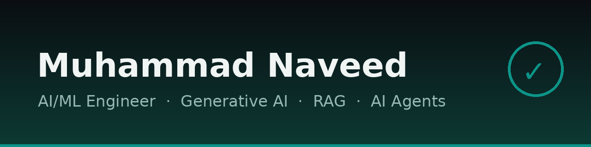
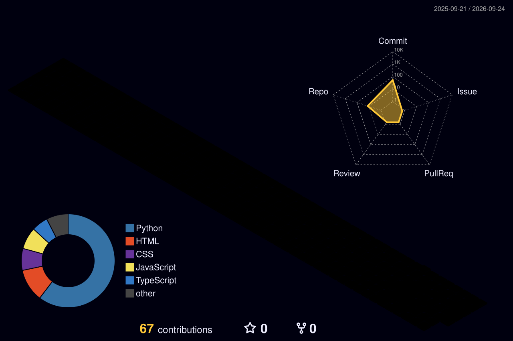

**Building practical AI that solves real problems.**

---

### 👨‍💻 About Me

- 🎓 BS Information Technology, University of Education, Lahore (2022 – 2026)
- 💼 AI Intern @ CodeAlpha
- 🔭 Currently working with LLMs, RAG pipelines and AI agents
- 📍 Lahore, Pakistan — open to on-site AI/ML roles

### 🛠️ Tech Stack

### 🚀 Featured Projects

| Project | What it does |
|---|---|
| 🛡️ [**Safe Child**](https://github.com/muhammadnaveedgurmani/safe-child) | Child-safety web app for parents in Pakistan — adaptive behavioral screening plus formal case-file preparation. Built with Reflex + Supabase, in Urdu & English. [🔴 Live demo](https://muhammadnaveedgurmanii-png--safe-child.modal.run) |
| 🌱 [**PlantGuard**](https://github.com/muhammadnaveedgurmani/PlantGuard) | Deep-learning plant disease detection |
| 💼 [**AI-JobMatch**](https://github.com/muhammadnaveedgurmani/AI-JobMatch) | AI-powered job matching |
| 💬 [**soul-ai-chatbot**](https://github.com/muhammadnaveedgurmani/soul-ai-chatbot) | Conversational AI chatbot |
| 🌐 [**language-translator**](https://github.com/muhammadnaveedgurmani/language-translator) | Language translation tool |

### 📊 GitHub Stats

### 🏙️ 3D Contribution Skyline

### 🐍 Contribution Snake

<picture>
  <source media="(prefers-color-scheme: dark)" srcset="./dist/github-snake-dark.svg" />
  
</picture>

### 🏆 GitHub Trophies

### ⏱️ Coding Activity

<!--START_SECTION:waka-->
<!--END_SECTION:waka-->

### 🎖️ Holopin Badges

---

*Technology should protect the most vulnerable among us.* 🛡️

